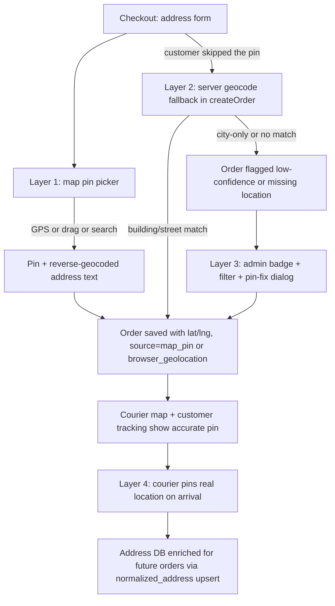

# Address Accuracy & Geolocation Plan

## Problem

When a customer types a wrong or imprecise address at checkout, the order has no
reliable `lat`/`lng`. Consequences today:

- Courier map & route optimization silently **drop** coordinate-less stops
  (`lib/utils/route.ts` `hasCoords`, `lib/data/couriers.ts`).
- Customer tracking cannot show the delivery on a map.
- Navigation falls back to a Google Maps **text search** of the same wrong
  address (`lib/utils/navigation.ts` `addressSearchUrl`) — which fails too.
- The only coordinate source is an *optional* browser-geolocation button in
  `components/store/checkout-view.tsx` that most customers never tap.

## Chosen Approach

**Free stack only**: OpenStreetMap Nominatim (geocoding) + the existing Leaflet
maps. No API keys, no cost. Defense in depth — 4 layers, each one catching what
the previous layer missed:

## Nominatim Policy Compliance (critical)

All Nominatim traffic goes through a **server-side proxy**, never from the
browser, because the usage policy requires a custom `User-Agent` / referer and
max 1 request/second:

- New route `app/api/geocode/route.ts` (forward + reverse modes).
- In-memory token-bucket queue enforcing ≤1 req/s (reuse patterns from
  `lib/server/rate-limit.ts`).
- Persistent cache table `geocode_cache` keyed by normalized query so repeated
  addresses never re-hit Nominatim.
- Per-IP rate limiting on the proxy endpoint to prevent abuse.
- Timeouts (~4s) so checkout never stalls; geocoding failure is non-fatal.

## Layer 1 — Checkout Pin Picker (prevention)

New client component `components/store/address-pin-picker.tsx`:

- Mini Leaflet map (loaded via `next/dynamic`, `ssr: false`, same pattern as
  `components/map/delivery-map.tsx`) with a **draggable pin**.
- "Use my location" button (existing `navigator.geolocation` flow) drops the pin
  at the GPS position with an accuracy circle.
- Small debounced search box → proxy → Nominatim forward search
  (`countrycodes=il`, `accept-language` from locale he/ar) → moves the pin.
- On pin settle: reverse-geocode via proxy → auto-fill/confirm `full_address`
  and `city` fields (customer can still edit).
- Sets form values `lat`, `lng`, `location_source: 'map_pin'`.

Checkout UX rules:

- The pin is **soft-required**: submitting without coordinates shows a
  confirmation dialog — "Without a precise location the courier may not find
  you — continue anyway?" with an explicit continue button. No hard block
  (protects conversion), but friction makes most users pin.
- `lib/validations/checkout.ts`: extend `location_source` enum to
  `browser_geolocation | map_pin | manual | geocoded | admin_pinned | courier_pinned`.

## Layer 2 — Server Geocoding Fallback (safety net)

New module `lib/server/geocoding.ts`:

- `geocodeAddress({ city, street, house_number, full_address })` →
  Nominatim structured query first, free-text fallback, `countrycodes=il`.
- Confidence mapping from the Nominatim result:
  - `high` — result type building/house/place of residence
  - `medium` — street-level match
  - `low` — city/locality centroid only
  - `none` — no result
- Returns `{ lat, lng, confidence, display_name, accuracy_m? }`, consults and
  writes `geocode_cache`.

Integration in `lib/actions/orders.ts` `createOrder`:

- If `customer.lat/lng` are null → call `geocodeAddress` (wrapped in a short
  timeout, errors swallowed). On success store coordinates with
  `location_source='geocoded'` + confidence. On `low`/`none` keep nulls but the
  order is now visibly flagged for admin (Layer 3).
- Pass confidence/accuracy through the `create_order` RPC `p_address` jsonb.

## Layer 3 — Admin Detection & Fix (ops safety net)

- `lib/data/orders.ts`: surface `location_source`, `location_confidence`,
  `lat/lng` presence in admin order rows.
- Orders browser (`components/admin/orders-browser.tsx` +
  `components/admin/order-filters.tsx`): warning badge "Missing location" /
  "Imprecise location" + a filter to list all such orders.
- New pin-fix dialog `components/admin/order-location-fix.tsx`: reuses the pin
  picker map; on save calls a new server action
  `updateOrderAddressLocation(orderId, lat, lng)` in
  `lib/actions/orders-admin.ts` → updates the order's address row with
  `location_source='admin_pinned'`, `location_confidence='high'`.

## Layer 4 — Courier Fallback & Data Enrichment

- `components/courier/courier-order-card.tsx`: for stops without coordinates
  show an "Unverified address" warning next to the existing text-search
  navigation buttons.
- "Pin actual location" action on the courier card (visible when coordinates
  are missing or low-confidence): opens the pin picker centered on the address
  text search result; saving calls a new action in
  `lib/actions/courier-portal.ts` → updates the address with
  `location_source='courier_pinned'`, confidence `high`.
- Because `create_order` upserts addresses keyed by `normalized_address`, the
  courier/admin pin permanently improves future orders to the same address.

## Database Migration

New file `supabase/migrations/20260101000010_address_location_quality.sql`:

1. `addresses`: add `location_confidence text check (location_confidence in
   ('high','medium','low'))`, `location_accuracy_m double precision`,
   `geocoded_at timestamptz`.
2. New table `geocode_cache (query_norm text primary key, lat double precision,
   lng double precision, confidence text, display_name text, created_at
   timestamptz default now())` — service-role only, RLS disabled for anon.
3. Recreate `create_order` RPC (copy latest definition from
   `20260101000009_auto_dispatch_finance.sql`) adding the new address fields to
   the address upsert.
4. Backfill: none required (existing null coordinates simply show as flagged).

## i18n

New keys in `messages/he.json` and `messages/ar.json`:

- `checkout.*`: pin picker labels, search placeholder, soft-required warning
  dialog texts, reverse-geocode status.
- `admin.*`: location badges, filter label, fix-dialog texts.
- `courier.*`: unverified-address warning, pin-location action.

## Types & Tests

- Update `types/database.types.ts` for the new columns/table.
- `tests/geocoding.test.ts`: confidence mapping from mocked Nominatim payloads,
  cache key normalization, structured-query building.
- Extend `tests/address.test.ts` if helpers change.
- Extend `tests/courier.test.ts` for the pin action payload validation.

## Implementation Order

1. Migration + types
2. `lib/server/geocoding.ts` + cache
3. Proxy route `app/api/geocode/route.ts` with rate limiting
4. `address-pin-picker.tsx` component
5. Checkout integration + validation changes
6. `createOrder` server fallback
7. Admin badge/filter + pin-fix dialog + action
8. Courier warning + pin-on-arrival action
9. i18n keys (he + ar)
10. Tests + manual verification pass

## Out of Scope / Future

- Google Places Autocomplete (paid) — the proxy + provider-shaped
  `geocodeAddress` interface make swapping providers a localized change.
- Delivery-zone polygon validation against the pin.
- Auto-detecting "address text far from pin" mismatches beyond reverse-geocode
  autofill.
