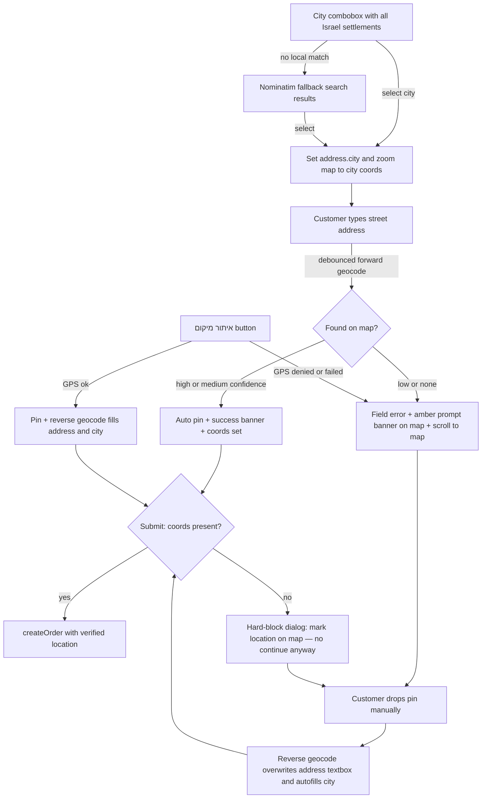

# Checkout Address Precision Flow

## Goal

Prevent customers from submitting made-up / non-existent addresses at checkout,
so the courier never wanders looking for a fake location. Every order must end
up with verified coordinates — either the typed address is found on the map, or
the customer drops a pin manually (or uses GPS locate).

## Confirmed Decisions

1. **Hard block** — submitting without verified coordinates is not allowed.
   The existing soft "continue anyway" dialog is removed. Escape hatch: manual
   pin drop is always possible, so no customer is truly stuck.
2. **Full Israel settlement dataset** — expand the static list from ~200 to
   ~1,200+ entries covering all cities, towns, kibbutzim, moshavim and
   villages, with a **Nominatim fallback search** in the combobox for anything
   missing from the static list.
3. **Pin updates the address textbox** — after a manual pin drop the
   reverse-geocoded address overwrites `full_address` and autofills `city`.
4. **איתור מיקום button runs the full flow** — GPS → pin on map →
   reverse-geocode → fill address + city. On GPS failure → prompt manual pin.

## Current State — what already exists

| Piece | File | Status |
|---|---|---|
| Settlement dataset ~200 entries + search | [`lib/data/israel-cities.ts`](../lib/data/israel-cities.ts) | exists, needs expansion |
| City picker combobox, he/ar, returns coords | [`components/store/city-combobox.tsx`](../components/store/city-combobox.tsx) | built but **unused anywhere** |
| Leaflet pin picker with `center`, `promptMessage`, `statusMessage` props | [`components/store/address-pin-picker.tsx`](../components/store/address-pin-picker.tsx) | built; checkout ignores `center`/`promptMessage` |
| Geocode proxy, forward/reverse/search, throttled + cached | [`app/api/geocode/route.ts`](../app/api/geocode/route.ts), [`lib/server/geocoding.ts`](../lib/server/geocoding.ts) | done |
| Client geocode helpers | [`lib/utils/geocode-client.ts`](../lib/utils/geocode-client.ts) | done |
| Server geocode fallback in createOrder | [`lib/actions/orders.ts`](../lib/actions/orders.ts) | done — keep as defense in depth |
| Checkout form: plain city Input, GPS-only locate button, soft warning dialog | [`components/store/checkout-view.tsx`](../components/store/checkout-view.tsx) | needs rewiring |
| Schema with lat/lng/location_source/confidence | [`lib/validations/checkout.ts`](../lib/validations/checkout.ts) | city currently optional |

`addressFormSchema` is consumed only by `checkoutSchema`, and `CityCombobox`
has no consumers — both are safe to change without touching admin flows.
The admin pin-fix dialog and courier pin flows reuse `AddressPinPicker` — its
props stay backward compatible.

## Target UX Flow

## Work Items

### 1. Dataset expansion — `lib/data/israel-cities.ts`

- Grow `ISRAEL_CITIES` to ~1,200+ entries: all cities, local councils,
  kibbutzim, moshavim, Arab/Druze/Bedouin towns and villages, Golan, Judea &
  Samaria settlements if delivered to, etc.
- Entry shape unchanged: `{ nameHe, nameAr, lat, lng, aliases? }`. Keep the
  existing curated Galilee entries as-is (accurate Arabic names); append the
  rest grouped by region with comments.
- Arabic names: official/common where known; Hebrew-name transliteration is an
  acceptable fallback for small Jewish settlements.
- Coordinates: settlement centroid, 4-decimal precision — enough for city zoom.
- Bundle size control: checkout loads `CityCombobox` via `next/dynamic` so the
  dataset is code-split out of the main checkout chunk.
- `searchIsraelCities` / `findIsraelCity` stay unchanged (already normalize
  Arabic letter variants and score exact > prefix > substring).

### 2. Pure address helpers — `lib/utils/address.ts`

- `formatGeocodedAddress(displayName: string): string` — trims a Nominatim
  display name like `Herzl St 12, Haifa, Haifa District, 3300000, Israel` to a
  short customer-facing line: street+number, city (drop district/postcode/
  country). Falls back to the first two segments.
- `extractCitySegment(displayName: string): string | null` — best-guess city
  segment, used to match against `findIsraelCity` for autofilling the city
  field.
- Unit tests in `tests/address.test.ts` (he + ar display names, missing
  segments, comma-free edge cases).

### 3. Combobox fallback — `components/store/city-combobox.tsx`

- When the local search returns 0 matches and query length ≥ 3: debounced
  (~500 ms) `geocodeSearch(`${query}, Israel`, 5)` via the existing proxy;
  keep only locality-type results (confidence `low` maps to city/town/village
  addresstypes in `mapConfidence`).
- Render them under a divider labeled "תוצאות נוספות מהמפה"; selecting one
  calls `onChange(name, { nameHe, nameAr: name, lat, lng })` so the parent
  still gets coordinates and the map zooms.
- Spinner state while the fallback request is in flight; stale-response guard
  via a sequence ref (same pattern as the pin picker).
- Empty-state text changes from "ניתן להמשיך עם השם שהוזן" to the fallback
  search UX (free-typed unmatched cities are no longer silently accepted —
  they either resolve via Nominatim or the customer picks a real result).

### 4. Checkout rewiring — `components/store/checkout-view.tsx`

**City field**
- Replace the plain `Input` for `address.city` with `CityCombobox`
  (`next/dynamic`, keep form control via `field.value` / `onChange`).
- New state: `selectedCity: IsraelCity | null`, `mapCenter: {lat,lng,zoom} | null`.
- On city select: `form.setValue("address.city", name)` + `mapCenter =
  { lat, lng, zoom: 13 }` → passed to `AddressPinPicker.center` → map zooms.
- On city change with a non-empty address: re-run address verification.

**Address verification (new)**
- State: `addressCheck: { status: idle | checking | found | not_found,
  confidence?, displayName? }`.
- Trigger: `onBlur` of `full_address` + 600 ms debounce, and on city change.
  Calls `geocodeForward({ full_address, city })`.
- `high`/`medium` → `form.setValue(lat/lng)`, `location_source: 'geocoded'`,
  `location_confidence`, pin moves via the picker `value` prop, green
  `statusMessage` banner: "הכתובת אותרה במפה".
- `low`/`none` → clear lat/lng, red inline error under the field, amber
  `promptMessage` banner on the map: "הכתובת לא נמצאה — נא לסמן את המיקום
  ידנית על ידי נעיצת סיכה", smooth `scrollIntoView` to the map card.
- Manual address edits set a `needsReverify` flag; a `programmaticRef` guard
  prevents reverse-geocode autofill from re-triggering verification loops.

**Pin → address textbox**
- `onReverseGeocode(displayName)` now **always** overwrites
  `address.full_address` with `formatGeocodedAddress(displayName)` (fires only
  on user-initiated pin moves — the picker's external-value effect uses
  `notify=false`, verified in `setPin`), autofills `address.city` from
  `extractCitySegment` + `findIsraelCity` when empty or unmatched, clears the
  not-found error, sets `location_source: 'map_pin'` and a success
  `statusMessage`: "הכתובת עודכנה לפי הסיכה".

**איתור מיקום button — `handleGeolocation` upgrade**
- GPS success → set lat/lng/accuracy (`location_source: 'browser_geolocation'`)
  → picker shows pin → checkout itself calls `geocodeReverse(lat, lng)` and
  fills `full_address` + `city` (formatted), success toast + banner.
- GPS denied/failed/unsupported → set the amber `promptMessage` ("איתור
  אוטומטי נכשל — סמנו את המיקום ידנית במפה") + scroll to map, replacing the
  current dead-end toast.

**Hard block on submit — `onSubmit`**
- `lat == null || lng == null` → no submit. Repurpose the existing
  `AlertDialog`: title "נדרש מיקום מדויק", body explains the address was not
  found on the map, single action "לסימון המיקום במפה" → closes dialog,
  scrolls to map, sets `promptMessage`. Remove `pendingValues` /
  continue-anyway path and the `locationWarningContinue` key usage.
- Zod schema stays lat/lng-optional (UX gate lives in `onSubmit` for clear
  messaging); server-side `createOrder` geocode fallback remains as Layer 2.

### 5. Validation — `lib/validations/checkout.ts`

- `address.city`: required, `min(2)` with message key `cityRequired`
  (safe — `addressFormSchema` has no other consumers).

### 6. i18n — `messages/he.json` + `messages/ar.json`

New/updated `checkout.*` keys (he + ar):
- `cityPlaceholder` → "בחר עיר או כפר בישראל..."
- `cityRequired`, `addressChecking`, `addressVerified`, `addressNotFound`
- `pinPromptManual`, `pinUpdatedAddress`, `locateFailedPrompt`
- `cityFallbackResults`, `locationRequiredTitle`, `locationRequiredDesc`,
  `locationRequiredAction`
- Remove/retire `locationWarningContinue` usage (key may stay unused-safe or
  be deleted together with the dialog copy).

### 7. Tests

- `tests/israel-cities.test.ts` (new): every entry within Israel bounds
  (lat 29.4–33.5, lng 34.0–36.0), no duplicate `nameHe`, search matches by
  Hebrew name / Arabic name / alias / prefix, dataset size ≥ 1000.
- `tests/address.test.ts`: `formatGeocodedAddress` + `extractCitySegment`
  cases.
- Existing suites must stay green (`tests/geocoding.test.ts` untouched —
  server logic unchanged).

### 8. Verification pass

- `npx vitest run`, lint, `next build`.
- Manual: select city → map zooms; type fake address → error + prompt +
  scroll; drop pin → address textbox updates; locate → fields autofill;
  submit without coords → blocked with dialog; submit with coords → order
  created with `location_source` + confidence stored.

## Implementation Order

1. Dataset expansion (`israel-cities.ts`) — biggest chunk, no dependents
2. Address helpers + tests
3. Combobox fallback search
4. Checkout rewiring (city field → verification → pin autofill → locate →
   hard block)
5. Schema city-required
6. i18n keys (he + ar)
7. Tests + build + manual pass

## Risks & Mitigations

- **Nominatim coverage gaps** (real address not found, esp. Arabic-addressed
  villages) → manual pin escape hatch always available; server cache means
  repeated checks are cheap; proxy already throttled to 1 req/s.
- **Dataset accuracy** — generated centroids are approximate; they only drive
  city-level zoom, never the final pin (that comes from geocode/GPS/manual).
- **Conversion friction** — accepted trade-off per product decision; the
  hard-block dialog points the user to the map instead of a dead end.
- **Bundle size** — combobox code-split via `next/dynamic`; dataset ships only
  with the checkout chunk.

## Out of Scope

- Delivery-zone polygon validation (rejecting pins outside the delivery area).
- Street-level autocomplete within a city (address field stays free text,
  verified by geocode).
- Admin/courier pin flows — already implemented, untouched.
