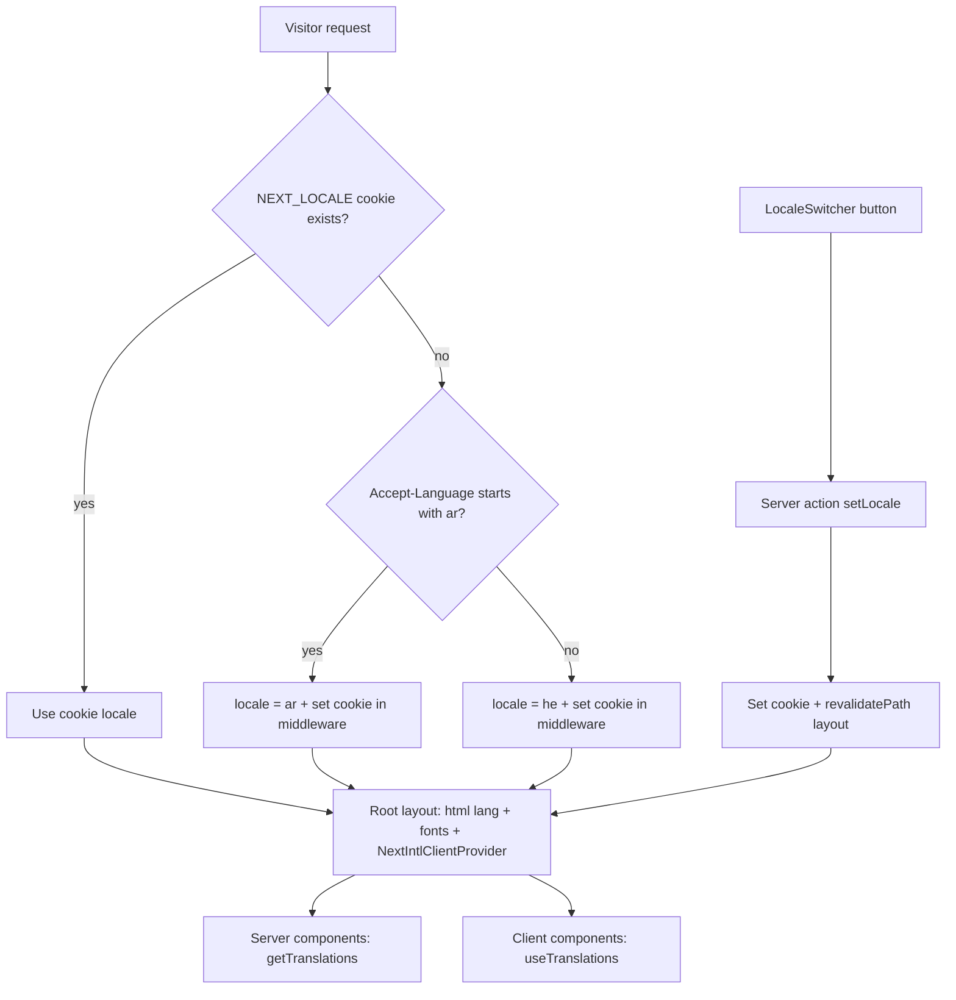

# Bilingual Storefront + Admin: Hebrew & Arabic

## Goal
Full Hebrew/Arabic bilingual site (storefront AND admin), cookie-based language
selection, no URL changes. Language switcher at the top (no flags):
- When site is in Hebrew → switcher shows: **انتقل للعربية**
- When site is in Arabic → switcher shows: **לעברית**

## Confirmed decisions
| Decision | Choice |
|---|---|
| URL strategy | Cookie only — URLs unchanged (`/cart`, `/checkout`, ...) |
| DB content | Fully bilingual — add `name_ar` / `description_ar` + admin fields + seed |
| Admin panel | Bilingual too (he + ar) |
| Default locale | Auto-detect from browser `Accept-Language`; fallback Hebrew |
| Direction | Both locales are RTL — `dir="rtl"` always, only `lang` changes |

## Architecture

- **Library**: `next-intl` in "without i18n routing" mode (cookie-based, no
  `[locale]` segment). Provides `getTranslations` (server), `useTranslations`
  (client), ICU plurals, and `NextIntlClientProvider`.
- **Messages**: `messages/he.json` + `messages/ar.json` with namespaces:
  `common`, `nav`, `home`, `catalog`, `product`, `cart`, `checkout`, `orders`,
  `orderSuccess`, `errors`, `validation`, `admin` (with sub-keys per screen).
- **Content localization helper**: `localizedText(locale, he, ar)` → returns
  `ar` value when locale is ar and value is non-empty, else falls back to `he`.

## Work breakdown

### 1. i18n infrastructure
- Install `next-intl`.
- `i18n/request.ts` — `getRequestConfig`: resolve locale from `NEXT_LOCALE`
  cookie (fallback `he`), load `messages/{locale}.json`.
- `next.config.mjs` — wrap with `createNextIntlPlugin`.
- `lib/i18n/config.ts` — `LOCALES = ["he","ar"]`, `DEFAULT_LOCALE = "he"`,
  `LOCALE_COOKIE = "NEXT_LOCALE"`, `localizedText()` helper.
- `middleware.ts` — extend matcher to all pages (exclude `_next`, static files,
  images). If no locale cookie: detect from `Accept-Language` (`ar` → ar,
  else he) and set the cookie on the response. Keep existing admin-auth logic
  intact.
- `lib/actions/locale.ts` — `setLocale` server action: set cookie
  (path=/, 1 year, SameSite Lax) + `revalidatePath("/", "layout")`.
- `components/locale-switcher.tsx` — submits `setLocale` with the other
  locale; label: he → `انتقل للعربية`, ar → `לעברית`; no flags; compact
  pill style matching header design.

### 2. Root layout, fonts, global files
- `app/layout.tsx`:
  - `const locale = await getLocale()`; `<html lang={locale} dir="rtl">`.
  - Add fonts: `Noto_Sans_Arabic` (variable `--font-arabic`) and `Cairo`
    (variable `--font-display-arabic`).
  - Wrap children in `NextIntlClientProvider`.
  - `generateMetadata()` — localized title/description per locale.
- `app/globals.css` — when `html[lang="ar"]`: map `--font-sans` →
  `--font-arabic`, display font → `--font-display-arabic`.
- `app/not-found.tsx`, `app/error.tsx`, `app/loading.tsx` — localized strings.
- `public/manifest.webmanifest` — `name`/`short_name` arrays with `lang`
  entries for he and ar.

### 3. Dictionaries
- Create `messages/he.json` — extract every existing Hebrew string from
  storefront + admin + validations + action errors + constants.
- Create `messages/ar.json` — complete Arabic translation of the same keys
  (including plural forms via ICU: e.g. orders-found count).

### 4. Database (bilingual content)
- New migration `supabase/migrations/20260101000005_i18n_arabic.sql`:
  - `alter table categories add column name_ar text;`
  - `alter table products add column name_ar text, add column description_ar text;`
  - `alter table order_items add column product_name_ar_snapshot text;`
  - Backfill not required (null → fallback to Hebrew at display time).
- `types/database.types.ts` — add `name_ar`, `description_ar`,
  `product_name_ar_snapshot` to `Category`, `Product`, `OrderItem`.
- `supabase/seed.sql` — add Arabic names/descriptions for demo categories and
  products; add `store_name_ar` setting.
- Settings: new `store_name_ar` key — update `AppSettings` type,
  `DEFAULT_SETTINGS` + `mapSettingsRows` in `lib/data/storefront.ts`,
  settings validation schema, admin settings form.
- `top_products` view stays Hebrew-based (admin stats; product identity column)
  — no view change needed.

### 5. Data layer + server actions
- `lib/data/storefront.ts` — select `name_ar`/`description_ar` in product and
  category queries; sort products by the locale-appropriate name; expose
  `store_name_ar`.
- `lib/actions/storefront.ts` — cart item details return both names;
  `localizedText` applied where consumed.
- `lib/actions/orders.ts` — on order creation, store
  `product_name_ar_snapshot` alongside Hebrew snapshot; localize returned
  error/success messages via locale-aware dictionary lookup.
- `lib/actions/products.ts`, `orders-admin.ts`, `customers.ts`, `settings.ts`,
  `auth.ts` — persist new Arabic fields; localize user-facing messages.
- `lib/constants.ts` — convert `NEXT_STATUS_ACTION_LABELS`,
  `PAYMENT_METHOD_LABELS`, `PAYMENT_STATUS_LABELS`, order-status labels to
  **dictionary key maps** (values become keys like `admin.orders.statusPaid`;
  components translate them).
- `lib/validations/*.ts` (checkout, customer, order, product, settings) —
  convert schemas to factories that accept a translate function or locale so
  Zod messages come from the dictionary (e.g. `checkoutFormSchema(t)`).
- `lib/utils/dates.ts` — accept locale param; use date-fns `he` / `ar` locales.
- `lib/utils/currency.ts` — `formatILS(agorot, locale?)`: keep Latin digits
  for both (use `ar` with `numberingSystem: "latn"`), keep ₪ symbol.

### 6. Storefront pages + components
Replace hardcoded Hebrew with dictionary usage (server: `getTranslations`,
client: `useTranslations`) and content with `localizedText`:
- Pages: `app/page.tsx`, `app/cart/page.tsx`, `app/checkout/page.tsx`,
  `app/products/[slug]/page.tsx`, `app/orders/page.tsx`,
  `app/order-success/[orderNumber]/page.tsx` (incl. per-page `metadata` /
  `generateMetadata`).
- Components: `store-chrome.tsx` (header + footer + mount LocaleSwitcher),
  `bottom-nav.tsx`, `store-hero.tsx`, `store-logo.tsx`, `cart-button.tsx`,
  `cart-view.tsx`, `checkout-view.tsx`, `customer-orders-view.tsx`,
  `order-timeline.tsx`, `product-card.tsx`, `add-to-cart-button.tsx`,
  `qr-code-card.tsx`, `mobile-sticky-bar.tsx`, `product-gallery.tsx`.
- Toasts in client components → translated via `useTranslations`.
- Order item names in cart / checkout / order views → pick snapshot or live
  name by locale with Hebrew fallback.

### 7. Admin panel
- `app/admin/(dashboard)/layout.tsx` + `admin-mobile-header.tsx` — mount
  LocaleSwitcher; localized chrome strings.
- `admin-sidebar.tsx` — `NAV_ITEMS` labels become dictionary keys.
- Extract strings to `admin.*` namespace in all admin pages
  (dashboard, products list/new/[id], categories, inventory, orders list/[id],
  customers list/[id], stats, settings, login) and components
  (product-form, category-dialog, settings-form, order-filters,
  product-filters, customer-filters, order-status-badge/controls/quick-status,
  inventory-adjust-dialog, delete dialogs, image-uploader, logo-uploader,
  pagination, sales-charts, customer-notes-editor, login-form).
- `product-form.tsx` + `lib/validations/product.ts` — add Arabic name and
  description inputs (optional fields, RTL inputs).
- `category-dialog.tsx` — add Arabic category name input.
- `settings-form.tsx` — add `store_name_ar` input.
- Product search (`lib/data/products.ts`) — match `name_he` OR `name_ar` OR
  slug; product tables show name by admin locale with fallback.
- Admin order item display — use `product_name_ar_snapshot` when admin is in
  Arabic.

### 8. Tests + verification
- Update `tests/orders.test.ts` — label constants are now key maps; assert
  keys instead of Hebrew strings (or assert via dictionary).
- Update `tests/settings.test.ts` if settings schema gains `store_name_ar`.
- Add `tests/i18n.test.ts` — `localizedText` fallback behavior; dictionary
  key parity between `he.json` and `ar.json` (same key sets).
- Run `npm run typecheck`, `npm run lint`, `npm run test`.
- Manual QA: switch languages on every storefront page and admin screen;
  verify RTL rendering, Arabic fonts, toasts, validation messages, order flow
  end-to-end in Arabic, and that first visit with an Arabic browser
  (`Accept-Language: ar`) opens in Arabic.

## Risks / notes
- Root layout reads a cookie → pages become dynamic; storefront is already
  dynamic (Supabase cookie client), so impact is minimal.
- Arabic translations must be complete — no mixed-language screens; the key
  parity test guards against drift.
- Existing orders have no Arabic snapshots → display falls back to Hebrew
  names gracefully.
- Both locales are RTL, so no layout mirroring work is needed beyond fonts.
