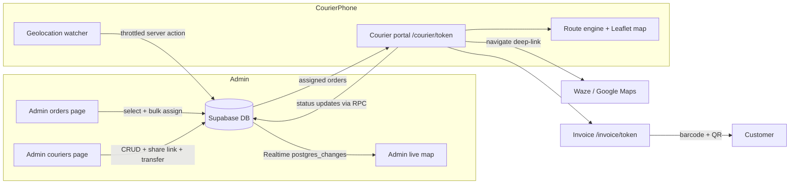
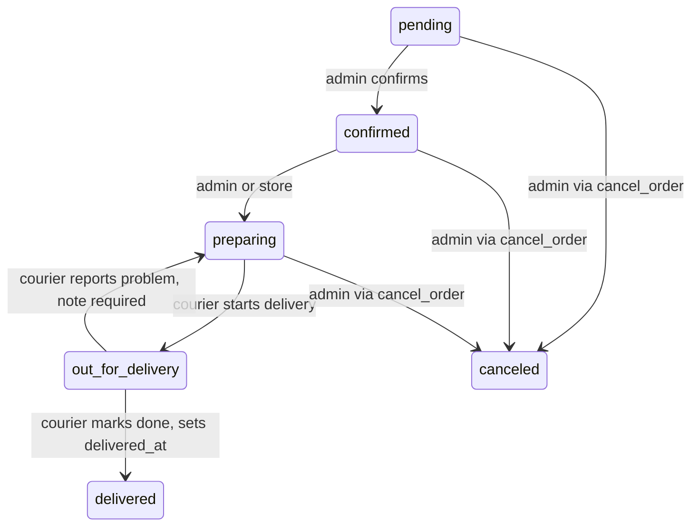

# Courier & Delivery System — Architecture Plan

A complete delivery-operations layer for the existing Next.js 15 + Supabase store:

1. **Courier portal** — a mobile-first page at `/courier/<token>` opened from a shareable link (WhatsApp/SMS). Shows the courier's assigned orders with full details, status controls, invoice links, a live map, navigation deep-links and smart route recommendations.
2. **Invoice page** — `/invoice/<invoiceToken>` per order: printable invoice with a **Code128 barcode** of the order number + QR to the tracking page. The courier shows/hands it to the customer.
3. **Admin assignment flow** — select orders on `/admin/orders` → bulk "Assign to courier" (courier A gets some, courier B gets others).
4. **Admin couriers management** — `/admin/couriers`: CRUD, shareable link management, **live map** of every courier's real-time position (Supabase Realtime), per-courier stats/history, transfer orders between couriers or return them to the store.

## Confirmed decisions

| Decision | Choice |
|---|---|
| Map provider | **Leaflet + OpenStreetMap** — free, no API key, dynamic-imported client-side |
| Courier access | **Secure token link** — 192-bit random token, no login, shareable; regenerable + revocable by admin |
| Live tracking | **Supabase Realtime** `postgres_changes` on `couriers` table (admin side); courier reports GPS via throttled server action |
| Route optimization | **Client-side** — haversine + nearest-neighbor + 2-opt, zero external APIs |
| Barcode | **jsbarcode** Code128 rendered client-side as SVG |
| Navigation | Deep-links: **Waze / Google Maps / Apple Maps**, address-search fallback when no coordinates |

---

## 1. High-level architecture



**Trust model:** the courier never authenticates with Supabase. Every portal read/write goes through Next.js server components / server actions that use the **service-role** client after validating the token. RLS stays admin-only for the new tables; Realtime for admins is authorized by the existing admin RLS policies.

---

## 2. Database — migration `supabase/migrations/20260101000007_couriers.sql`

### 2.1 `couriers`

```sql
create table if not exists couriers (
  id uuid primary key default gen_random_uuid(),
  full_name text not null,
  phone_norm text unique not null,
  phone_display text not null,
  access_token text unique not null default encode(gen_random_bytes(24), 'hex'),
  vehicle_type text not null default 'car',        -- car | scooter | bike | foot
  color text not null default '#e11d48',           -- marker + badge identity
  is_active boolean not null default true,
  last_lat double precision,
  last_lng double precision,
  last_location_at timestamptz,
  notes text,
  created_at timestamptz not null default now(),
  updated_at timestamptz not null default now()
);
create index if not exists idx_couriers_token on couriers(access_token);
create index if not exists idx_couriers_active on couriers(is_active);
```

### 2.2 `orders` — new columns

```sql
alter table orders add column if not exists courier_id uuid references couriers(id) on delete set null;
alter table orders add column if not exists assigned_at timestamptz;
alter table orders add column if not exists delivered_at timestamptz;
alter table orders add column if not exists invoice_token text unique;
-- backfill invoice tokens for existing orders
update orders set invoice_token = encode(gen_random_bytes(16), 'hex') where invoice_token is null;
alter table orders alter column invoice_token set default encode(gen_random_bytes(16), 'hex');
create index if not exists idx_orders_courier on orders(courier_id) where courier_id is not null;
```

`on delete set null` + the assignment RPC guarantee that deleting/deactivating a courier never orphans order history — orders simply return to the store pool.

### 2.3 `courier_events` — audit trail

```sql
create table if not exists courier_events (
  id uuid primary key default gen_random_uuid(),
  courier_id uuid references couriers(id) on delete cascade,
  order_id uuid references orders(id) on delete cascade,
  actor text not null default 'admin',             -- admin | courier | system
  event_type text not null,                        -- assigned | transferred | returned_to_store | status_changed | problem_reported | token_regenerated | deactivated
  from_value text,
  to_value text,
  note text,
  created_at timestamptz not null default now()
);
create index if not exists idx_courier_events_courier on courier_events(courier_id, created_at desc);
create index if not exists idx_courier_events_order on courier_events(order_id);
```

### 2.4 RPC `set_orders_courier` — assign / transfer / return-to-store in one transaction

```sql
create or replace function set_orders_courier(
  p_order_ids uuid[],
  p_courier_id uuid,            -- null = return to store
  p_admin_user_id uuid default null,
  p_note text default null
) returns int language plpgsql security definer set search_path = public as $$
declare v_count int := 0; v_prev uuid; v_type text;
begin
  if p_courier_id is not null and not exists (
    select 1 from couriers where id = p_courier_id and is_active
  ) then raise exception 'COURIER_NOT_FOUND'; end if;

  for v_prev in
    select courier_id from orders
    where id = any(p_order_ids)
      and status not in ('delivered','canceled')
    limit 1
  loop null; end loop; -- per-row previous courier logged inside the update loop

  -- per-order update + event log (skips delivered/canceled orders)
  -- event_type: 'assigned' when prev is null, 'transferred' when prev <> new,
  --             'returned_to_store' when new is null
  -- sets assigned_at = now() on assign/transfer
  ...
  return v_count;
end $$;
```

(The implementation loops over `p_order_ids`, locks each row `for update`, skips terminal statuses, writes `courier_events` with from/to courier ids, and updates `orders.courier_id`/`assigned_at`.)

### 2.5 RPC `courier_update_order_status` — token-scoped status changes

```sql
create or replace function courier_update_order_status(
  p_token text,
  p_order_id uuid,
  p_to_status order_status_enum,
  p_note text default null
) returns text language plpgsql security definer set search_path = public as $$
declare v_courier couriers; v_from order_status_enum;
begin
  select * into v_courier from couriers
   where access_token = p_token and is_active;
  if not found then raise exception 'INVALID_TOKEN'; end if;

  select status, courier_id into v_from, ... from orders where id = p_order_id for update;
  if not found then raise exception 'ORDER_NOT_FOUND'; end if;
  if orders.courier_id is distinct from v_courier.id then
    raise exception 'ORDER_NOT_ASSIGNED';       -- ownership check
  end if;

  -- allowed transitions for couriers:
  --   confirmed|preparing -> out_for_delivery
  --   out_for_delivery    -> delivered          (sets delivered_at = now())
  --   out_for_delivery    -> preparing          (problem report, p_note required)
  -- anything else raises INVALID_TRANSITION

  -- writes order_events (note prefixed with courier name) + courier_events
  return v_to::text;
end $$;
```

Rate limits are enforced in the server action layer (see §7), keeping the DB functions pure.

### 2.6 RLS + Realtime

```sql
alter table couriers enable row level security;
alter table courier_events enable row level security;
-- admin-only policies, same pattern as 0004_rls.sql:
create policy "admin_all_couriers" on couriers for all using (is_admin()) with check (is_admin());
create policy "admin_all_courier_events" on courier_events for all using (is_admin()) with check (is_admin());
-- live position feed for the admin map:
alter publication supabase_realtime add table couriers;
```

No anon access to `couriers` — the token is resolved **only** server-side with the service role.

---

## 3. Order & delivery lifecycle



Assignment is **orthogonal** to status: admin assigns orders to a courier at any non-terminal status; the courier drives the last-mile transitions. Admins keep full power via the existing `update_order_status` RPC (unchanged).

---

## 4. Courier portal — `/courier/[token]`

### 4.1 Page structure

- `app/courier/[token]/page.tsx` — **server component**: validates token via service role (`getCourierByToken`), loads courier + assigned orders (active first, delivered today collapsed), renders `<CourierApp>` client shell. Invalid/inactive token → friendly "link expired" screen (he/ar) with store contact.
- Fully mobile-first, RTL, themed with the existing warm design system (`shadow-soft`, rounded-2xl cards, primary accents), sonner toasts, skeleton loaders.
- Standalone-capable (no admin chrome): sticky header with courier name + store logo, sticky bottom tab bar **List | Map**.

### 4.2 List view + recommendations

- **Recommendations panel** at top (client, recomputed on each position fix):
  - "Start with order #X — closest, ~1.2 km / ~6 min"
  - Full suggested sequence with per-leg distance + ETA, total route distance
  - Algorithm: haversine from courier's live position → nearest-neighbor → 2-opt refinement (§5)
  - Orders without coordinates are listed last with a "no location" badge
- **Order card** (expandable): order number, status badge, customer name, `tel:` call button, address, items summary (names × qty), total + **payment method/status** (cash-to-collect highlighted in amber), customer notes, distance badge, recommended-stop number.
- **Per-card actions:**
  - **Navigate** → bottom sheet: Waze / Google Maps / Apple Maps (platform-aware ordering; iOS shows Apple first) + address-search fallback
  - **Invoice** → opens `/invoice/<invoiceToken>` (barcode + QR to hand to the customer)
  - **Call customer** → `tel:` link
  - **Status**: `Start delivery` (→ out_for_delivery) then `Mark delivered` (confirm dialog + optional note) and `Report problem` (required note → back to preparing). Optimistic UI + animated success check.
- Completed orders move to a collapsed "Delivered today" section with time + total collected.

### 4.3 Map view

- Leaflet map (OSM tiles) via the shared `<DeliveryMap>` component:
  - Numbered `divIcon` markers in suggested-route order, colored by status (active = primary, delivered = emerald), **pulse animation on the recommended first stop**
  - Courier's live position marker (accuracy circle)
  - Animated dashed polyline connecting stops in suggested order
  - Marker tap → popup mini-card: customer, address, distance, Navigate + Delivered buttons
  - Controls: fit-all-bounds, locate-me, recenter-on-route
- Falls back gracefully when geolocation is denied (route ordered from store address; banner explains).

### 4.4 Live location reporting

`use-courier-location` hook:
- `navigator.geolocation.watchPosition`, report when **≥15 s since last report AND ≥25 m movement** (or forced every 60 s)
- Pauses on `document.hidden`, stops when there are no active orders
- Calls `reportCourierLocation` server action (token-scoped, rate-limited 12/min) → updates `couriers.last_lat/last_lng/last_location_at` → Realtime pushes to the admin live map

### 4.5 Data freshness

- `router.refresh()` every **30 s** while visible (picks up new assignments/transfers) + immediately after every mutation. No client Supabase dependency — keeps the portal lightweight and RLS untouched.

---

## 5. Route engine — `lib/utils/route.ts` (pure, unit-tested)

```ts
haversineMeters(a: LatLng, b: LatLng): number
optimizeRoute(origin: LatLng | null, stops: RouteStop[]): RoutePlan
// RouteStop = { id, lat?, lng?, serviceMinutes? }
// RoutePlan = { ordered: RouteStop[], legsMeters: number[], totalMeters, totalMinutes, unlocated: RouteStop[] }
```

- Nearest-neighbor construction from origin (store address when no GPS), then **2-opt** improvement until stable (n is small — dozens of stops max — O(n²) is instant)
- ETA model: urban average 25 km/h + 3 min service per stop (constants, tunable)
- Deterministic tie-breaking; pure functions → `tests/route.test.ts` (haversine known distances, ordering sanity, 2-opt never worsens, missing-coords handling, empty/single stop)

`lib/utils/navigation.ts`:

```ts
wazeUrl(lat, lng)          // https://waze.com/ul?ll=LAT,LNG&navigate=yes
googleMapsUrl(lat, lng)    // https://www.google.com/maps/dir/?api=1&destination=LAT,LNG&travelmode=driving
appleMapsUrl(lat, lng)     // https://maps.apple.com/?daddr=LAT,LNG&dirflg=d
addressSearchUrl(address)  // https://www.google.com/maps/search/?api=1&query=ENCODED  (fallback, no coords)
```

---

## 6. Invoice — `/invoice/[token]`

- Server component resolves the order by `invoice_token` (service role, rate-limited). Token is unguessable (128-bit) so the page is safe to open/share; it exposes only that one order.
- Layout: store logo/name/settings header, order number + date, customer + address, items table, subtotal/delivery/discount/total, payment method + status stamp (PAID / CASH DUE), footer.
- **Code128 barcode** of `order_number` (jsbarcode → SVG client component) — scannable handoff to the customer.
- **QR code** (existing `qrcode` pkg, server-generated data URL) linking to `/orders?order=<number>` tracking.
- **Print button** + `@media print` stylesheet (clean A4/A5 receipt), "Save as PDF" via the browser print dialog.
- Invoice link surfaces in: courier order card, admin order detail, (optionally later) order-success page.

---

## 7. Server actions & data layer

### `lib/data/couriers.ts` (service role, server-only)

| Function | Purpose |
|---|---|
| `getCouriers()` | list + per-courier active/delivered-today counts |
| `getCourierById(id)` | profile + active orders + recent events + stats |
| `getCourierByToken(token)` | portal bootstrap: courier + assigned orders with items + address snapshots |
| `getCourierStats(id)` | totals: delivered, today, avg assign→deliver minutes, cash collected |
| `getCouriersLivePositions()` | admin live-map seed data (couriers + their active order stops) |

`lib/data/orders.ts` extended: embed `couriers(full_name,color)` in `getOrders`, new `courier` filter param.

### `lib/actions/couriers.ts` — admin-guarded (`requireAdmin`), zod-validated

`createCourierAction`, `updateCourierAction`, `setCourierActiveAction`, `regenerateCourierTokenAction`, `assignOrdersAction(orderIds, courierId)`, `returnOrdersToStoreAction(orderIds)`, `transferOrdersAction(orderIds, toCourierId)` — all call the `set_orders_courier` RPC (or direct update for CRUD), log events, `revalidatePath('/admin/orders' | '/admin/couriers' | ...)`.

### `lib/actions/courier-portal.ts` — token-guarded, no session

| Action | Validation | Rate limit |
|---|---|---|
| `courierUpdateOrderStatusAction(token, orderId, toStatus, note?)` | token active + order ownership + transition matrix (in RPC) | 30/min per token |
| `reportCourierLocationAction(token, lat, lng, accuracy?)` | token active, coords in range | 12/min per token |

Both use the existing `rateLimit()` with `identifier: token`.

### `lib/validations/courier.ts`

zod schemas: `courierSchema` (name ≥2, Israeli phone via existing `normalizeIsraeliPhone`, vehicle enum, color hex), `assignOrdersSchema` (1–200 uuids + courier uuid), `courierStatusSchema` (enum of the 3 courier-reachable statuses), `locationSchema` (lat −90..90, lng −180..180, accuracy 0..10000).

---

## 8. Admin experience

### 8.1 Orders page — bulk assignment

- Checkbox on each row/card + select-all; **sticky bottom bulk bar** (slides up): "N selected → Assign to courier".
- Assign dialog: courier radio list with color dot, active-load count, vehicle; confirm → `assignOrdersAction` → toast + revalidate. Option "also set status to out_for_delivery" is intentionally **not** included — status stays with the courier flow.
- New **courier column/badge** (color dot + name, "Unassigned" muted) and a **courier filter** dropdown (incl. "unassigned") in `OrderFilters`.
- Order detail page: **Courier card** — assigned courier (link to profile) or assign button; actions: change courier, return to store; shows assignment/delivery timestamps + invoice link.

### 8.2 `/admin/couriers` — management + live map

- Header actions: **New courier** dialog. Tabs: **List | Live map**.
- Table: color dot, name, phone, vehicle, active orders, delivered today, last-seen (live "now" pulse when <60 s), status. Row menu: open profile, **copy link**, **share via WhatsApp** (`https://wa.me/?text=` + native `navigator.share` fallback), **show QR** of the link, regenerate token (confirm — old link dies), edit, deactivate.
- **Live map tab**: `<DeliveryMap>` with all active couriers (color-coded markers, name popups) + their active order stops; **Supabase Realtime** subscription (`postgres_changes`, UPDATE on `couriers`) moves markers smoothly (CSS transition); order stops refreshed every 60 s. Sidebar panel lists couriers with mini-stats; clicking zooms to that courier.

### 8.3 `/admin/couriers/[id]` — courier profile

- Stat cards: active orders, delivered today, delivered total, avg delivery time, cash collected today.
- Live position mini-map + "last seen X min ago".
- **Active orders table** with per-row: transfer to another courier (dialog), return to store; bulk selection supported.
- History: delivered orders (with timestamps) + full `courier_events` timeline (who did what, when).
- Share-link card (copy / WhatsApp / QR / regenerate).

### 8.4 Sidebar

`NAV_ITEMS` gains `{ href: '/admin/couriers', labelKey: 'couriers', icon: Bike }` after Orders.

---

## 9. Dependencies

```
npm i leaflet jsbarcode
npm i -D @types/leaflet
```

- Leaflet loaded **only** inside `next/dynamic(..., { ssr: false })` map components; `leaflet/dist/leaflet.css` imported there. Custom `divIcon` markers (numbered pins, courier avatars) — avoids the broken-default-icon asset problem entirely.
- jsbarcode is client-only (renders into SVG ref in `useEffect`).

## 10. i18n

New namespaces in `messages/he.json` + `messages/ar.json`:

- `courier.*` — portal: greeting, tabs, statuses, actions, navigate sheet, recommendations, problem dialog, delivered section, empty states, invalid-link screen, location prompts
- `invoice.*` — invoice page labels, print, barcode alt
- `admin.couriers.*` — list, dialogs, live map, profile, stats, share, events timeline
- `admin.orders.*` additions — selection bar, assign dialog, courier column/filter

## 11. Security checklist

- Tokens: 192-bit courier / 128-bit invoice, unique-indexed, resolved server-side only; regenerate = instant revocation; `is_active=false` blocks everything
- Ownership enforced in the RPC (`ORDER_NOT_ASSIGNED`) — a courier can never touch another courier's order
- Transition matrix enforced in DB, not just UI
- Rate limits on every token endpoint (existing `rateLimit`, token-scoped identifiers)
- RLS admin-only on `couriers`/`courier_events`; Realtime authorized through RLS
- PII minimized: portal payload contains only delivery-relevant fields
- `/courier/*` and `/invoice/*` are public routes — middleware already only guards `/admin/*`, no change needed

## 12. Performance checklist

- Map + Leaflet code-split behind the Map tab / dynamic import
- Portal queries select trimmed column lists; items embedded in one query
- GPS throttling (15 s / 25 m) + pause when hidden + stop when idle
- Polling budgets: portal 30 s, admin live-map data 60 s, positions via Realtime (push, not poll)
- Partial index on `orders(courier_id)`, token indexes unique
- Optimistic UI on status changes; `revalidatePath` scoped to affected routes

## 13. New & modified files

**New**

```
supabase/migrations/20260101000007_couriers.sql
lib/validations/courier.ts
lib/data/couriers.ts
lib/actions/couriers.ts
lib/actions/courier-portal.ts
lib/utils/route.ts
lib/utils/navigation.ts
tests/route.test.ts
components/map/delivery-map.tsx
components/map/admin-live-map.tsx
components/courier/courier-app.tsx
components/courier/courier-order-card.tsx
components/courier/courier-status-actions.tsx
components/courier/navigate-sheet.tsx
components/courier/recommendations-panel.tsx
components/courier/use-courier-location.ts
components/invoice/invoice-barcode.tsx
app/courier/[token]/page.tsx
app/invoice/[token]/page.tsx
app/admin/(dashboard)/couriers/page.tsx
app/admin/(dashboard)/couriers/[id]/page.tsx
components/admin/courier-dialog.tsx
components/admin/couriers-table.tsx
components/admin/courier-share-card.tsx
components/admin/courier-transfer-dialog.tsx
components/admin/order-assign-dialog.tsx
components/admin/orders-selection-bar.tsx
components/admin/order-courier-card.tsx
```

**Modified**

```
package.json                                   — leaflet, jsbarcode, @types/leaflet
types/database.types.ts                        — Courier, CourierEvent, Order fields
lib/data/orders.ts                             — courier embed + filter
app/admin/(dashboard)/orders/page.tsx          — selection + badges + filter
app/admin/(dashboard)/orders/[id]/page.tsx     — courier card
components/admin/order-filters.tsx             — courier filter
components/admin/admin-sidebar.tsx             — nav item
messages/he.json, messages/ar.json             — new namespaces
```

## 14. Implementation order

1. **DB + domain core**: migration, types, validations
2. **Data + actions**: `lib/data/couriers.ts`, admin actions, portal actions, orders.ts extension
3. **Pure utils + tests**: route engine, navigation links, unit tests
4. **Map component**: shared Leaflet `DeliveryMap`
5. **Courier portal**: page, list, cards, status flow, navigate sheet, recommendations, location hook, polling
6. **Invoice**: page + barcode + QR + print
7. **Admin assignment**: orders page selection/bulk bar/dialog/badges/filter, order-detail courier card
8. **Admin couriers**: list page, dialogs, share/QR, live map with Realtime, profile page
9. **i18n + polish**: he/ar messages, animations, skeletons, empty states, RTL audit
10. **Verification**: typecheck, lint, vitest, build, manual end-to-end (create courier → assign → share → deliver → track live → transfer → invoice print)

## 15. End-to-end acceptance flow

1. Admin creates courier "Moshe", copies link, sends via WhatsApp
2. Admin selects 4 orders on `/admin/orders` → assigns to Moshe; 2 other orders → courier "Ali"
3. Moshe opens the link: sees 4 orders, grants location, recommendations show the closest first stop, map shows numbered pins + animated route
4. Moshe taps Navigate → Waze opens; delivers → Mark delivered (confirm) → card animates to done, admin live map shows his position moving in real time
5. Customer receives the invoice link view with scannable barcode + QR
6. Admin transfers one of Ali's orders to Moshe from `/admin/couriers/[id]`; returns another to the store — both reflected in event timelines
7. Admin regenerates Moshe's token — old link stops working immediately
