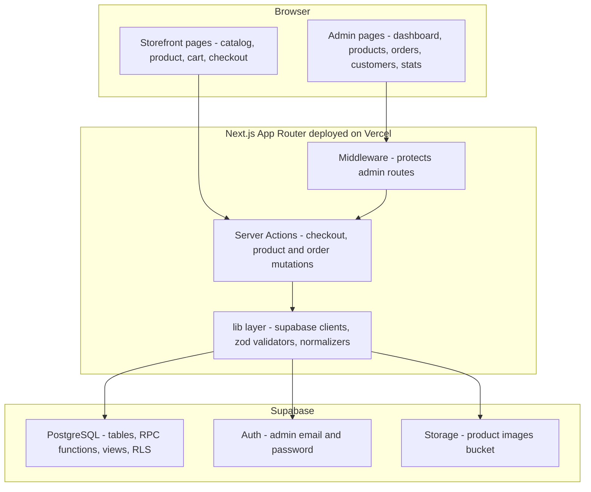
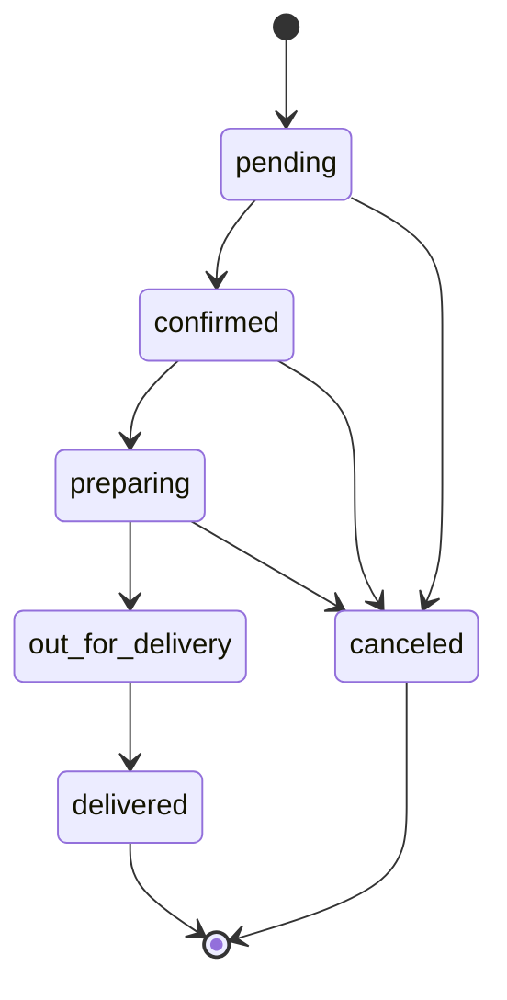
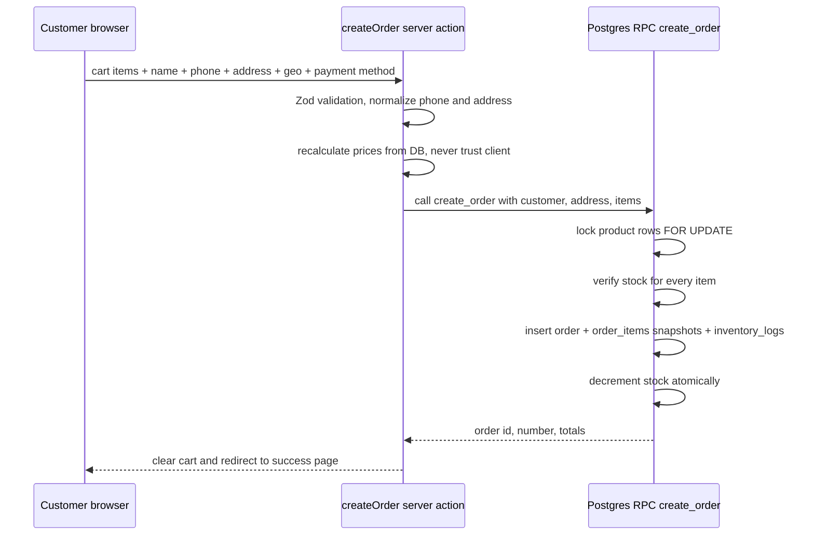

# E-Commerce Full-Stack System — Implementation Plan

**Stack:** Next.js App Router + TypeScript + Supabase (PostgreSQL, Auth, Storage) + Tailwind CSS + shadcn/ui + Vercel
**UI language:** Hebrew, full RTL (`lang="he" dir="rtl"`)
**Supabase provisioning:** User creates the Supabase project; repo ships `.env.example` + versioned SQL migration files + seed file.

---

## 1. System Overview

A single monolithic Next.js application containing:

- **Storefront** (public, no customer accounts): catalog, product page, cart (localStorage), checkout with phone/address/geolocation, order confirmation.
- **Admin dashboard** (Supabase Auth email/password, role-checked): products, categories, inventory with change log, orders with status lifecycle, customers identified by normalized phone/address, statistics, settings.
- **Server layer**: Server Actions + a transactional Postgres RPC (`create_order`) so prices are recomputed server-side and stock can never oversell.



---

## 2. Folder Structure

```text
app/
  layout.tsx                  # he/RTL root layout, Hebrew font
  (store)/
    page.tsx                  # home / catalog
    products/[slug]/page.tsx
    cart/page.tsx
    checkout/page.tsx
    order-success/[orderNumber]/page.tsx
  admin/
    login/page.tsx
    layout.tsx                # sidebar nav, auth guard
    dashboard/page.tsx
    products/page.tsx  new/page.tsx  [id]/page.tsx
    categories/page.tsx
    inventory/page.tsx
    orders/page.tsx  [id]/page.tsx
    customers/page.tsx  [id]/page.tsx
    stats/page.tsx
    settings/page.tsx
components/
  ui/                         # shadcn/ui
  store/                      # ProductCard, CartDrawer, CheckoutForm...
  admin/                      # tables, forms, charts
  layout/
lib/
  supabase/client.ts server.ts admin.ts
  utils/phone.ts address.ts currency.ts dates.ts
  validations/checkout.ts product.ts order.ts customer.ts settings.ts
  actions/products.ts categories.ts inventory.ts orders.ts customers.ts auth.ts settings.ts
types/
  database.types.ts
supabase/
  migrations/
    0001_schema.sql
    0002_functions.sql
    0003_views.sql
    0004_rls.sql
  seed.sql
plans/                        # this file
tests/                        # vitest unit tests
.env.example
README.md
```

---

## 3. Data Model & Key Decisions

Tables (per approved spec): `categories`, `products`, `product_images`, `customers`, `addresses`, `orders`, `order_items`, `inventory_logs`, `order_events`, `settings`, `admin_profiles`.

Non-negotiable rules baked into the design:

1. **Money as integers** — all prices/totals in agorot (`int`), formatted with `Intl.NumberFormat("he-IL", { currency: "ILS" })`.
2. **Server-side pricing** — checkout action re-reads product prices from DB; client cart totals are display-only.
3. **Atomic stock** — a single Postgres RPC `create_order(...)` runs the whole order in one transaction: `SELECT ... FOR UPDATE` on product rows, verify stock, insert `orders` + `order_items` snapshots + `inventory_logs`, decrement stock. Any failure rolls back everything. A companion `cancel_order(...)` restores stock.
4. **Snapshotting** — `order_items` stores product name + unit price at order time; `orders` stores customer name/phone + `address_snapshot jsonb`.
5. **Phone normalization** — `libphonenumber-js` based `normalizeIsraeliPhone()` → `+972XXXXXXXXX`; unique key `customers.phone_norm`.
6. **Address normalization** — `normalizeAddress()` (trim, lowercase, strip punctuation, collapse whitespace) stored in `addresses.normalized_address`; `pg_trgm` GIN index + `duplicate_address_candidates` view flag duplicates for **manual review only** (never auto-merge).
7. **No customer accounts** — customers are upserted implicitly at checkout by `phone_norm`.

### Order lifecycle



Every transition writes an `order_events` row; transitions into `canceled` restore stock via `cancel_order`.

### Checkout flow



---

## 4. Security / RLS Strategy

- RLS enabled on **all** tables.
- Public (anon) read: active products, active categories, product images only.
- Public write: **none** — order creation happens exclusively through the server action using the service-role client (server-only import).
- Admin: policies check an authenticated user exists in `admin_profiles`; middleware additionally guards all `/admin/*` routes.
- Storage: `product-images` bucket — public read, admin-only write (policy via `admin_profiles`).
- `SUPABASE_SERVICE_ROLE_KEY` only in `lib/supabase/admin.ts` with `import "server-only"`.
- Checkout input hardened: Zod validation, quantity caps, inactive-product rejection.

---

## 5. Environment Variables (`.env.example`)

```env
NEXT_PUBLIC_SUPABASE_URL=
NEXT_PUBLIC_SUPABASE_ANON_KEY=
SUPABASE_SERVICE_ROLE_KEY=
NEXT_PUBLIC_SITE_URL=http://localhost:3000
```

---

## 6. Implementation Phases

### Phase 0 — Scaffolding
Next.js + TS + Tailwind + ESLint; install all deps; shadcn/ui init; RTL root layout with Hebrew font; folder skeleton; `.env.example`; README stub.

### Phase 1 — Database
- `0001_schema.sql`: extensions (pgcrypto, pg_trgm), enums, `order_number_seq`, all tables, `set_updated_at` triggers, indexes (exactly per approved spec).
- `0002_functions.sql`: `create_order` RPC (transactional, row locks, snapshots, inventory logs), `cancel_order` RPC (stock restore + event).
- `0003_views.sql`: `customer_stats`, `duplicate_address_candidates`, sales stats views (revenue per day, top products, orders by status).
- `0004_rls.sql`: RLS + policies + storage bucket.
- `seed.sql`: demo categories/products/settings.
- `types/database.types.ts` matching the schema.

### Phase 2 — Core lib
Supabase clients (browser/server/admin); `phone.ts`, `address.ts`, `currency.ts`, `dates.ts`; Zod validation modules shared by client forms and server actions; Vitest unit tests for normalizers and money math.

### Phase 3 — Admin auth
Login page + login/logout actions; middleware guarding `/admin/*` with session + `admin_profiles` check; admin layout with RTL sidebar; documented SQL snippet to bootstrap the first admin.

### Phase 4 — Admin products & inventory
Products table (search/filter/pagination); create/edit form (RHF+Zod, shekel input → agorot storage); image upload with compression → Storage → `product_images` (order/alt/delete); categories CRUD; inventory page with reason-logged adjustments and low-stock list; all mutations via authorized server actions.

### Phase 5 — Storefront
Catalog + category filtering; product page with gallery; cart context persisted to localStorage with stock-aware quantities; store header/footer with cart badge.

### Phase 6 — Checkout
Checkout form (name, phone, address fields, notes, payment method cash/card); browser geolocation with graceful denial fallback; `createOrder` server action per the sequence diagram; success page; all edge cases (empty cart, inactive product, insufficient stock, invalid phone, denied geo).

### Phase 7 — Admin orders
Orders list with status/payment filters + search; order detail with items, customer, address (map link), event timeline; status transitions with `order_events`; cancel with stock restore; mark-paid action.

### Phase 8 — Admin customers & stats
Customers list from `customer_stats` (search, sort); customer profile with notes, history, totals, frequent products, addresses, duplicate-address candidates; stats dashboard with recharts (revenue per day/week/month, order counts, AOV, top products, status breakdown).

### Phase 9 — Settings & polish
Settings page (store name, delivery fee, low-stock threshold) backed by `settings` table; PWA manifest + icons + metadata; global error/not-found pages.

### Phase 10 — QA & handoff
Full build + lint + tests green; walk the edge-case checklist (spec §24); finalize README with Supabase setup, migration/seed instructions, admin bootstrap, Vercel deployment guide.

---

## 7. Edge Cases to Verify (acceptance checklist)

- Product with 0 stock cannot be ordered; two concurrent checkouts for the last unit → exactly one succeeds.
- Canceling an order restores stock and logs it.
- Editing/deleting a product never breaks historical orders (snapshots).
- Same phone in formats `0501234567` / `050-123-4567` / `+972501234567` → one customer.
- Addresses differing by spaces/commas → same `normalized_address`; different phone + same address → flagged as duplicate candidate, not merged.
- Geolocation denied → manual address still works.
- Empty cart / inactive product / negative price / invalid status transition → rejected with clear errors.
- `SUPABASE_SERVICE_ROLE_KEY` never reachable from client bundle.

## 8. Out of Scope for MVP (phase 2 of the product)

Real card gateway (Cardcom/Tranzila/etc.), customer accounts/OTP, coupons, product variants, courier system, invoices/receipts, WhatsApp integration, mobile app.
