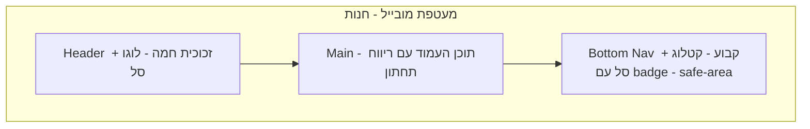
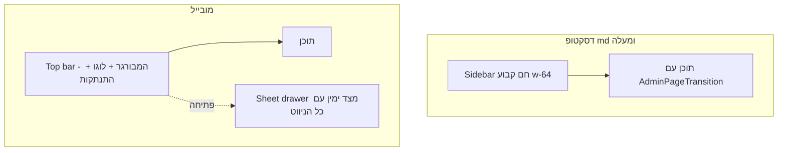

# עיצוב מחדש — Mobile-First Warm Boutique Redesign

**כיוון:** חם ואומנותי — מאפייה/מעדנייה בוטיק. קרם, שמפניה, קרמל-חום-זהב, טיפוגרפיה חמה, תחושת אפליקציית מובייל (PWA).
**היקף:** החנות ללקוח במלואה + דאשבורד הניהול כולל התאמת מובייל אמיתית.
**עיקרון מנחה:** כל שינוי הוא ויזואלי/UX בלבד — ללא שינוי לוגיקה עסקית, Server Actions, סכמות או זרימות נתונים.

---

## 1. Design System — globals.css

### פלטת אור — קרם בוטיק (OKLCH)

| Token | ערך | תפקיד |
|---|---|---|
| `--radius` | `0.875rem` | פינות רכות יותר בכל ה-UI |
| `--background` | `oklch(0.982 0.010 88)` | קרם חם — נייר |
| `--foreground` | `oklch(0.270 0.035 45)` | אספרסו |
| `--card` / `--popover` | `oklch(0.996 0.005 88)` | שנהב |
| `--primary` | `oklch(0.530 0.115 52)` | קרמל — קרום לחם |
| `--primary-foreground` | `oklch(0.980 0.008 88)` | קרם |
| `--secondary` | `oklch(0.945 0.028 80)` | שמפניה/חול |
| `--secondary-foreground` | `oklch(0.350 0.050 50)` | חום עמוק |
| `--muted` | `oklch(0.955 0.015 85)` | אזורי רקע שקטים |
| `--muted-foreground` | `oklch(0.530 0.030 55)` | טאופ חם |
| `--accent` | `oklch(0.930 0.045 85)` | נגיעת דבש — hover/active |
| `--accent-foreground` | `oklch(0.320 0.050 50)` | |
| `--destructive` | `oklch(0.550 0.210 28)` | אדום חם |
| `--border` / `--input` | `oklch(0.905 0.028 78)` | גבול חם רך |
| `--ring` | `oklch(0.620 0.110 60)` | טבעת פוקוס זהובה |
| `--chart-1..5` | אמבר `oklch(0.70 0.15 70)`, טרקוטה `oklch(0.60 0.17 40)`, זית `oklch(0.60 0.10 130)`, זהב `oklch(0.80 0.14 85)`, קקאו `oklch(0.45 0.08 50)` | גרפים בדאשבורד |
| `--sidebar` | `oklch(0.965 0.015 85)` | משטח צד חם |
| `--sidebar-accent` | `oklch(0.925 0.040 82)` | פילול קרמל לפריט פעיל |

### פלטת כהה — אספרסו (למי שמוסיף `.dark` בעתיד)

| Token | ערך |
|---|---|
| `--background` | `oklch(0.210 0.015 45)` |
| `--card` / `--popover` | `oklch(0.255 0.018 45)` |
| `--foreground` | `oklch(0.950 0.010 85)` |
| `--primary` | `oklch(0.740 0.120 70)` — אמבר זהוב |
| `--primary-foreground` | `oklch(0.240 0.030 50)` |
| `--secondary` / `--muted` / `--accent` | `oklch(0.300 0.020 50)` / `oklch(0.280 0.018 50)` / `oklch(0.330 0.030 55)` |
| `--border` | `oklch(1 0.01 85 / 12%)` |
| `--ring` | `oklch(0.740 0.120 70)` |
| `--sidebar` | `oklch(0.235 0.016 45)` |

### תוספות ל-`@theme inline`

- `--font-display: var(--font-display-hebrew), serif` — כותרות
- `--shadow-soft: 0 1px 3px oklch(0.45 0.06 55 / 8%), 0 4px 14px oklch(0.45 0.06 55 / 6%)`
- `--shadow-lift: 0 4px 10px oklch(0.45 0.06 55 / 10%), 0 12px 28px oklch(0.45 0.06 55 / 10%)`
- `--color-primary-soft` ודומיו לפי צורך (אופציונלי — אפשר עם `/10` opacity)

### Utilities חדשים (ב-`@layer utilities` או CSS רגיל)

```css
.no-scrollbar        /* הסתרת scrollbar בשורת שבבי קטגוריות */
.pb-safe             /* padding-bottom: env(safe-area-inset-bottom) — iOS */
.pt-safe
.animate-pop-in      /* scale 0.9→1 + fade, ל-badge ולכפתור הצלחה */
.animate-ring-pulse  /* טבעת פולס חגיגית בדף אישור */
```

- לשמר את `page-enter` הקיים ואת `prefers-reduced-motion`.
- `body`: להוסיף רקע טקסטורה עדינה — `radial-gradient` חם מאוד שקוף או להשאיר `bg-background` נקי (החלטה: נקי, הטקסטורה רק ב-hero).

## 2. טיפוגרפיה + PWA — app/layout.tsx, manifest

- הוספת `Frank_Ruhl_Libre` מ-`next/font/google` (משקולות 400–800, variable `--font-display-hebrew`) — סריף עברי אלגנטי לכותרות, שם החנות, מחירים ו-hero.
- `Noto_Sans_Hebrew` נשאר פונט הגוף (`--font-sans`).
- ייצוא `viewport`: `{ width: device-width, initialScale: 1, viewportFit: cover, themeColor: #95582b }` (themeColor כקירוב ה-primary הקרמלי).
- `manifest.webmanifest`: `theme_color: #95582b`, `background_color: #FAF6EE`, עדכון שם/תיאור אם נדרש.
- מחלקת עזר `font-display` תיושם אוטומטית דרך ה-theme של Tailwind v4.

## 3. רכיבי UI משותפים

- **חדש** `components/ui/sheet.tsx` — shadcn Sheet (מבוסס `@radix-ui/react-dialog` שכבר מותקן) ל-drawer הניווט במובייל בדאשבורד.
- `components/ui/button.tsx` — ברירת מחדל `shadow-soft` ל-variant default; `active:scale-[0.98]` גלובלי; גובה `size-lg` ≥ 44px למגע.
- `components/ui/card.tsx` — `rounded-2xl` + `shadow-soft`, מעבר ל-`shadow-lift` ב-hover איפה שרלוונטי.
- `components/ui/badge.tsx` — גוונים חמים (secondary על בסיס שמפניה).
- לא לגעת ב-form/input/select/dialog וכו' מעבר למה שהטוקנים משנים אוטומטית.

## 4. חנות — Storefront

### מבנה המעטפת במובייל



### `components/store/store-chrome.tsx`

- Header: `sticky top-0 z-40`, רקע `bg-background/80 backdrop-blur-xl`, גבול תחתון `border-border/60`, גובה `h-14` במובייל / `h-16` בדסקטופ.
- לוגו: אייקון `Wheat` (lucide) בעיגול גרדיאנט קרמל + שם החנות ב-`font-display` — מרגיש בוטיק.
- ניווט עליון: בקטלוג דסקטופ להשאיר קישור "קטלוג"; במובייל הניווט עובר ל-bottom nav.
- **חדש** `components/store/bottom-nav.tsx` (client): `fixed bottom-0 inset-x-0 z-40 md:hidden`, רקע זכוכית `bg-background/90 backdrop-blur-xl border-t`, שני טאבים — קטלוג (Store/Home) וסל (ShoppingCart) עם badge ספירה `animate-pop-in`, `pb-safe`, גובה טאב ≥ 56px, מצב פעיל בצבע primary עם אינדיקטור עדין.
- `main`: `pb-24 md:pb-8` כדי לא להיתקע מתחת ל-bottom nav; `max-w-5xl`.
- Footer: עדין, `text-xs`, עם קו עליון חם; נסתר/מקוצר במובייל (ה-bottom nav תופס).
- לשמר `CartProvider` ואת מבנה ה-async settings.

### `app/page.tsx` — קטלוג/בית

- **Hero** (רכיב חדש `components/store/store-hero.tsx` או inline): כרטיס `rounded-3xl` עם גרדיאנט חם `from-primary/15 via-accent to-secondary`, שם החנות ב-`font-display text-3xl`, שורת tagline, קישוט — אייקון Wheat גדול שקוף (opacity 10%) או טבעות רדיאליות; `overflow-hidden`.
- שבבי קטגוריות: שורה אופקית נגללת `flex gap-2 overflow-x-auto no-scrollbar snap-x` (במקום `flex-wrap`) — כל שבב `snap-start shrink-0 rounded-full`, שבב פעיל = רקע primary עם `shadow-soft`, לא פעיל = `bg-card border`.
- רשת מוצרים: `grid-cols-2 sm:grid-cols-3 lg:grid-cols-4 gap-3 sm:gap-4`.
- מצב ריק: איור/אייקון חם + כפתור "חזרה לכל המוצרים".

### `components/store/product-card.tsx`

- `rounded-2xl border-border/70 bg-card shadow-soft hover:shadow-lift hover:-translate-y-0.5 active:scale-[0.98] transition-all`.
- תמונה `aspect-square rounded-t-2xl`, zoom עדין `group-hover:scale-105`.
- תג מבצע: אם יש `compare_at_price` — תג "מבצע" פינתי בגרדיאנט טרקוטה + מחיר מחוק.
- אזל מהמלאי: overlay חום-כהה/60 עם תגית לבנה.
- שם המוצר `font-medium line-clamp-2`, מחיר ב-`font-display font-bold text-primary`.
- `AddToCartButton` ככפתור עגול קומפקטי (icon+טקסט קצר במובייל) עם פידבק לחיצה.

### `components/store/add-to-cart-button.tsx`

- וריאנט קומפקטי לכרטיס: עגול `rounded-full` עם אייקון Plus + "הוספה"; בדף מוצר: `size-lg w-full rounded-xl` עם גרדיאנט/צל.
- מיקרו-אינטראקציה: `active:scale-95`, ואחרי הוספה — החלפה קצרה ל-check ירוק-זית (state מקומי + timeout) — "נוסף ✓".

### `app/products/[slug]/page.tsx` + `product-gallery.tsx`

- breadcrumb קטן (קטלוג ← שם מוצר) ב-`text-xs text-muted-foreground`.
- פריסה: `md:grid-cols-2 gap-8`; במובייל גלריה ראשונה ואז פרטים.
- גלריה: `rounded-3xl overflow-hidden shadow-soft`, תמונות ממוזערות `rounded-xl` עם טבעת primary לפעילה.
- מחיר גדול `font-display text-4xl text-primary`, מחיר השוואה מחוק.
- תגי מלאי: "במלאי" ירוק-זית עדין, "נשארו X" אמבר, "אזל" אדום חם.
- **Sticky purchase bar למובייל** (fixed bottom, מעל ה-bottom-nav או במקומו בדף זה): תמצית מחיר + `AddToCartButton fullWidth` + `pb-safe`. בדסקטופ הכפתור נשאר inline.

### `app/cart/page.tsx` + `cart-view.tsx`

- כותרת `font-display text-2xl` + ספירת פריטים.
- כרטיסי פריטים: `rounded-2xl border bg-card shadow-soft p-3`, תמונה `rounded-xl size-20`.
- סטפר כמות: קבוצה אחודה `rounded-full bg-muted` עם כפתורים עגולים — מינימום 36px למגע.
- מחיקה: אייקון אשפה עדין שהופך אדום ב-hover/active.
- **סיכום דביק למובייל**: במקום כרטיס הסיכום מתחת לרשימה — `fixed bottom-0` בר עם סה"כ + CTA "לצ'קאאוט" (עם חץ), `pb-safe`, זכוכית + צל עליון. בדסקטופ: עמודה צדדית `lg:sticky lg:top-24` כרטיס `rounded-2xl shadow-soft`.
- מצב סל ריק: איור חם (Wheat/ShoppingCart בעיגול שמפניה) + כפתור primary גדול.

### `app/checkout/page.tsx` + `checkout-view.tsx`

- כרטיסי הסקשנים: `rounded-2xl shadow-soft`, כותרת עם אייקון קטן בעיגול primary/10 (User, MapPin, CreditCard, Note).
- שדות: `h-11`+ למגע, focus ring זהוב.
- **אופן תשלום**: שני כרטיסי בחירה גדולים עם אייקונים (Banknote / CreditCard), בחירה = גבול primary + רקע primary/5 + check עגול — במקום radio רגיל.
- כפתור "איתור מיקום" מעוצב כ-outline חם עם אייקון.
- **סיכום הזמנה דביק למובייל**: `fixed bottom-0` בר — סה"כ + "ביצוע הזמנה" עם ספינר במצב pending, `pb-safe`. בדסקטופ עמודת צד כקיים (אבל מעוצבת חם).
- פריטי הסיכום עם תמונות `rounded-lg`.

### `app/order-success/[orderNumber]/page.tsx`

- מעגל חגיגי: גרדיאנט ירוק-זית/קרמל, אייקון CheckCircle2 עם `animate-pop-in` וטבעת `animate-ring-pulse` סביבו.
- כותרת `font-display text-3xl`, כרטיס פרטי הזמנה `rounded-2xl shadow-soft` עם שורות ברורות.
- כפתור "חזרה לקטלוג" גדול ועגול.

## 5. דאשבורד ניהול

### מעטפת — `app/admin/(dashboard)/layout.tsx`



- מובייל: להחליף את מסילת האייקונים `w-16` ב-**top bar** (`sticky top-0 h-14 z-40 bg-background/85 backdrop-blur-xl border-b`): כפתור המבורגר שפותח `Sheet` (side="right" ל-RTL) עם רשימת הניווט המלאה + אימייל + התנתקות; לוגו "ניהול חנות" במרכז/צד.
- דסקטופ: סיידבר `w-64` עם רקע `bg-sidebar` חם, לוגו עם אייקון Wheat בעיגול גרדיאנט, פריט פעיל = פילול קרמל `rounded-xl` + נקודת primary (לשמר את לוגיקת `pendingHref` וה-Loader הקיימים).
- `main`: `p-4 md:p-6` + רקע `bg-muted/30` עדין; לשמר `AdminPageTransition`.

### `app/admin/login/page.tsx` + `components/admin/login-form.tsx`

- רקע: גרדיאנט חם אלכסוני + טבעות רדיאליות שקופות (כמו hero בחנות).
- כרטיס מרכזי `rounded-3xl shadow-lift` עם לוגו, כותרת `font-display`, שדות גדולים, כפתור primary עגול-רך מלא.

### `app/admin/(dashboard)/dashboard/page.tsx`

- כותרת ברכה `font-display` + תאריך עברי/רגיל.
- כרטיסי קיצורים: אייקון בתוך עיגול גרדיאנט (primary/15), hover lift, חץ "כניסה" עדין.
- אם קיימים נתוני stats — להציג כרטיסי KPI (הכנסות, הזמנות, מלאי נמוך) בסגנון חם; אם אין — להשאיר quick links בלבד (בלי לשנות data layer).

### שאר דפי הניהול — מעבר רספונסיבי

- כל הטבלאות (products, orders, customers, inventory, categories): עטיפת `overflow-x-auto` + `min-w` מתאים; גלילה אופקית חלקה במובייל.
- היכן שיש טבלה צפופה במובייל — שקילת תצוגת כרטיסים (למשל הזמנות: כרטיס עם מספר, לקוח, סכום, סטטוס) עם `md:hidden` והטבלה `hidden md:block`. זה שינוי תצוגה בלבד.
- פילטרים (`product-filters`, `order-filters`, `customer-filters`): פריסת `flex-wrap` עם רווחים, גובה מגע ≥ 40px, Select/DatePicker נפתחים נכון במובייל.
- דיאלוגים (`category-dialog`, `inventory-adjust-dialog`, alert-dialog): לוודא `max-h` + גלילה פנימית במובייל.
- `sales-charts`: גרפים עם `ResponsiveContainer` וצבעי chart חדשים; גובה מתאים למובייל.
- `order-status-badge` / `order-status-controls`: גוונים חמים עקביים לסטטוסים.
- `pagination`: כפתורים ≥ 40px.

## 6. מיקרו-אינטראקציות ואיכות

- `active:scale` עקבי לכפתורים וכרטיסים לחיצים (0.97–0.98).
- מעברי hover/active ≤ 200ms, easing `cubic-bezier(0.16, 1, 0.3, 1)`.
- `prefers-reduced-motion` — לכבד בכל האנימציות החדשות.
- יעדי מגע ≥ 44×44px בכל אינטראקציה במובייל.
- Skeletons קיימים — לצבוע לגוונים חמים (muted).
- Toaster: `position="top-center"` נשאר; לוודא שקריאה חמה (אפשר `toastOptions` עם rounded-xl).

## 7. אימות

1. `npm run typecheck`
2. `npm run lint`
3. `npm run test`
4. `npm run build`
5. בדיקה ויזואלית: 360×800 (מובייל), 768 (טאבלט), 1440 (דסקטופ) — חנות ודאשבורד.
6. PWA: manifest + theme-color + safe areas.

## 8. קבצים — סיכום

**עריכה:** `app/globals.css`, `app/layout.tsx`, `public/manifest.webmanifest`, `components/ui/button.tsx`, `components/ui/card.tsx`, `components/ui/badge.tsx`, `components/store/store-chrome.tsx`, `components/store/product-card.tsx`, `components/store/add-to-cart-button.tsx`, `components/store/cart-button.tsx`, `components/store/product-gallery.tsx`, `components/store/cart-view.tsx`, `components/store/checkout-view.tsx`, `app/page.tsx`, `app/products/[slug]/page.tsx`, `app/cart/page.tsx`, `app/checkout/page.tsx`, `app/order-success/[orderNumber]/page.tsx`, `app/admin/(dashboard)/layout.tsx`, `components/admin/admin-sidebar.tsx`, `app/admin/login/page.tsx`, `components/admin/login-form.tsx`, `app/admin/(dashboard)/dashboard/page.tsx`, + דפי טבלאות/פילטרים/דיאלוגים באדמין לפי סעיף 5.

**חדשים:** `components/ui/sheet.tsx`, `components/store/bottom-nav.tsx`, `components/store/store-hero.tsx`, `components/admin/admin-mobile-header.tsx`, `components/store/mobile-sticky-bar.tsx` (רכיב עזר משותף לסטקים התחתונים במוצר/סל/צ'קאאוט).

**אין שינוי ב:** lib/, supabase/, contexts/, validations, server actions, tests.
