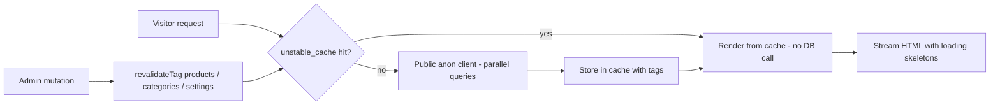
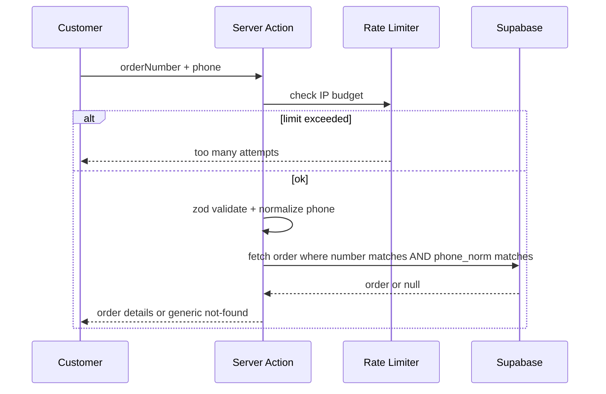
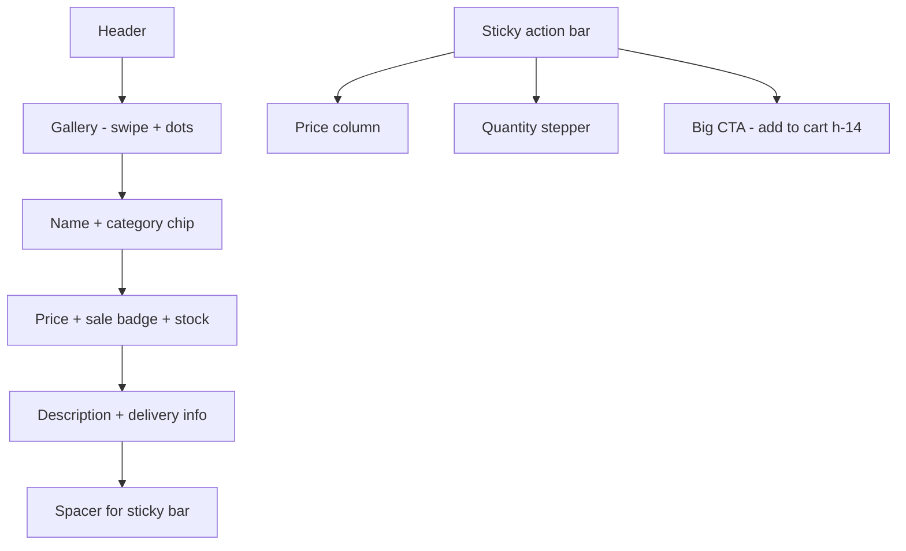

# Performance, Security & Product Page Upgrade

Context: production Docker deployment is slow; every operation takes a long time. Security must be hardened professionally. The product page (PDP) needs a large, accessible Add-to-Cart CTA and correct, professional presentation of price, image and details for a mobile web app.

Decisions confirmed by the user:
- Slowness is in the **production Docker build** (the Dockerfile itself is a correct standalone prod build).
- Order lookup will **require phone + order number** (breaking change accepted).

---

## A. Performance

### Root causes found
1. Every storefront query uses the cookie-based `createClient()` from `lib/supabase/server.ts`, forcing **fully dynamic SSR** with 2–4 **sequential** Supabase roundtrips per request:
   - `getSettings()` — called by `StoreChrome` on **every** page.
   - `getStorefrontCategories()` + `getStorefrontProducts()` — home page (categories fetched **twice** when a category filter is active).
   - `getPublicProductBySlug()` — product page fetches the product **twice** (page + `generateMetadata`).
2. No caching layer at all (no `unstable_cache`, no `React cache()` dedupe), even though RLS already allows anonymous reads of active products/categories/settings and a cookies-free `createPublicClient()` exists.
3. Cart view re-calls the `getCartProductDetails` server action on **every quantity change** (`useEffect` depends on `items`).
4. No `loading.tsx` / skeletons on storefront routes → nothing paints until all DB roundtrips finish (perceived slowness).
5. Images served only as WebP; SVG allowed without CSP; no `minimumCacheTTL`.

### Fixes
1. **`lib/data/storefront.ts` refactor**
   - Switch all storefront reads to `createPublicClient()` (cookies-free; RLS already restricts to active rows).
   - Wrap each read in `unstable_cache` with tags: `settings`, `categories`, `products`, `product:{slug}`; revalidate ~300s as a safety net.
   - Wrap in `React cache()` for per-request dedupe (fixes double-fetch in product page and double category fetch).
   - `getStorefrontProducts(categorySlug)`: filter by category id via a single join/lookup instead of re-querying categories; keep locale-aware sorting.
2. **Tag revalidation on admin mutations** — in `lib/actions/products.ts`, `settings.ts`, `orders-admin.ts`, `customers.ts`: add `revalidateTag("products")`, `revalidateTag("categories")`, `revalidateTag("settings")`, `revalidateTag("product:{slug}")` next to existing `revalidatePath` calls so the storefront updates immediately after admin edits.
3. **Streaming & skeletons** — add `app/products/[slug]/loading.tsx` and `app/loading.tsx` improvements (gallery + price + CTA skeleton matching final layout to avoid CLS).
4. **Cart details caching** — in `components/store/cart-view.tsx`: depend on the sorted ids key (not `items`), keep previous details while refreshing, add a short-lived module cache so quantity edits never hit the network.
5. **Checkout action** — `lib/actions/orders.ts`: run the products query and settings read in parallel (`Promise.all`), settings from the cached reader.
6. **`next.config.mjs` images** — `formats: ["image/avif", "image/webp"]`, `minimumCacheTTL: 3600`, and `contentSecurityPolicy: "default-src 'self'; script-src 'none'; sandbox"` for the SVG case.

### Resulting request flow

---

## B. Security

### Vulnerabilities found
| # | Issue | Severity | Location |
|---|-------|----------|----------|
| 1 | Order search by **name only** or **partial phone** returns full PII (names, phones, addresses, notes) — full customer-base scraping | Critical | `searchCustomerOrders` in `lib/actions/orders-public.ts` |
| 2 | **Sequential order numbers** `YYYYMMDD-000001` + lookup by number only → enumerate all orders | Critical | `getPublicOrder`, `getPublicOrdersByNumbers`, schema default |
| 3 | **No rate limiting** on login (brute force), checkout (spam orders / stock drain), order lookup (scraping) | High | all public server actions |
| 4 | **No security headers** (CSP, X-Frame-Options, nosniff, Referrer-Policy, Permissions-Policy) | High | `next.config.mjs` |
| 5 | `dangerouslyAllowSVG: true` **without CSP** → stored XSS via SVG | High | `next.config.mjs` |
| 6 | Upload accepts any MIME type (only size checked) | Medium | `uploadProductImage` in `lib/actions/products.ts` |
| 7 | `getCartProductDetails` — unbounded, unvalidated ids array | Medium | `lib/actions/storefront.ts` |
| 8 | Locale cookie missing `secure` flag in production | Low | `middleware.ts` |

Already solid (keep): RLS with `is_admin()`, transactional `create_order` RPC with row locks, server-side price recomputation, `requireAdmin()` on every admin action, `server-only` service-role client.

### Fixes
1. **Phone + order number required for any order lookup** (user-approved):
   - `getPublicOrder(orderNumber, phone)`: normalize phone with `normalizeIsraeliPhone`, require **exact** match against the order's customer `phone_norm` (join via `customers`) — no `ilike`, no partial digits.
   - `getPublicOrdersByNumbers(numbers, phone)`: same ownership check for every number.
   - `searchCustomerOrders`: require a valid full phone (exact `phone_norm` match); name becomes an optional additional filter only; remove the `.or()` string interpolation entirely.
2. **UI flows updated** (`app/orders/page.tsx`, `app/order-success/[orderNumber]/page.tsx`, `components/store/customer-orders-view.tsx`, `lib/utils/recent-orders.ts`):
   - Checkout success stores `{orderNumber, phone}` in localStorage; success page and order history send both.
   - Tracking form asks for phone + order number; server component in `app/orders` no longer queries by number alone (moves to a client action call with both fields).
3. **Rate limiting** — new `lib/server/rate-limit.ts`: in-memory fixed-window limiter keyed by IP (single-instance Docker, no Redis needed), `x-forwarded-for` aware, with these budgets:
   - login: 5/min per IP; createOrder: 5/10min per IP+phone; order lookups: 10/min per IP.
   - Returns a translated "too many attempts" error; applied inside the server actions (works regardless of middleware matcher).
4. **Security headers** via `headers()` in `next.config.mjs`:
   - `Content-Security-Policy` (default-src 'self'; img-src 'self' data: https://*.supabase.co; connect-src 'self' https://*.supabase.co; style-src 'self' 'unsafe-inline'; script-src 'self' 'unsafe-inline' — required by Next.js; frame-ancestors 'none'; base-uri 'self'; form-action 'self')
   - `X-Frame-Options: DENY`, `X-Content-Type-Options: nosniff`, `Referrer-Policy: strict-origin-when-cross-origin`, `Permissions-Policy: camera=(), microphone=(), geolocation=(self)`, `Strict-Transport-Security` when behind HTTPS.
5. **Input validation** — zod schemas for every public action input (`getCartProductDetails`: max 50 UUIDs; lookup params: trimmed strings with max lengths).
6. **Upload hardening** — allowlist `image/jpeg|png|webp|avif`, reject SVG, derive extension from the allowlist (not from the client file name), keep the 10MB cap.
7. **Cookie hardening** — `secure: process.env.NODE_ENV === "production"` on the locale cookie.
8. **Optional (recommended)** — migration changing the `order_number` default to `YYYYMMDD-XXXXXX` with a random suffix so business volume and order ids are not enumerable. Existing numbers stay valid.

### New lookup flow

---

## C. Product page (mobile-first PDP)

### Problems today
- Sticky bar CTA is only `h-11` (44px) with a small price; no quantity control; no sale price in the bar.
- Gallery: no swipe, no dots, small 64px thumbnails, no placeholder.
- Missing: category link, discount percent, delivery info, structured data.

### Fixes
1. **`MobileStickyBar` redesign** (product page usage):
   - Full-bleed bar: price column (large price + compare-at strike + sale badge) and a **full-width `h-14` rounded-full primary CTA** with cart icon and bold `text-base` label.
   - Quantity stepper (−/+ with stock cap) inline in the bar; stepper state shared with the CTA via a small client component `ProductPurchasePanel`.
   - `pb-safe` padding, stronger top border/shadow so it reads as an action bar, `aria-live="polite"` region announcing "added to cart".
2. **`AddToCartButton` upgrade**: new `xl` size (h-14, text-base, larger icon), optional `quantity` prop, `aria-label` with product name, keeps the check-mark success animation, disables at stock cap.
3. **`ProductGallery` upgrade**: touch swipe between images (native scroll-snap carousel), dot indicators, `placeholder="blur"` for remote images (generated blurDataURL or solid muted background), larger 72–80px thumbnails, keep `priority` on first image and correct `sizes`.
4. **Product details**: category chip linking to `/?category=slug`, discount percent badge when on sale, refined stock badges, short delivery-info row (from settings: free-delivery threshold), and **JSON-LD `Product` structured data** (name, image, description, offers with ILS price and availability) injected server-side.
5. **Desktop**: right column becomes a sticky buy panel (price, stock, quantity, CTA, delivery info) so the CTA stays visible while scrolling.
6. All new strings added to `messages/he.json` and `messages/ar.json`.

### Mobile PDP layout

---

## Execution order & verification

1. Performance items 1–6 (biggest user-visible impact).
2. Security items 7–14 (critical PII fixes first: lookup actions + rate limiter, then headers/uploads/cookies, optional migration last).
3. PDP items 15–19.
4. Verify: `npm run typecheck`, `npm run lint`, `npm run test`, rebuild Docker image, manual pass over: home → product → add to cart → cart → checkout → success → order tracking (phone + number) → admin product edit (confirm storefront cache invalidates instantly).

Notes:
- Rate limiter is in-memory by design (single container). If the app ever scales to multiple instances, swap the storage layer for Redis/Upstash behind the same interface.
- CSP `script-src 'unsafe-inline'` is required by Next.js inline scripts; everything else is locked down. If a stricter CSP is desired later, nonces via middleware are the next step.
